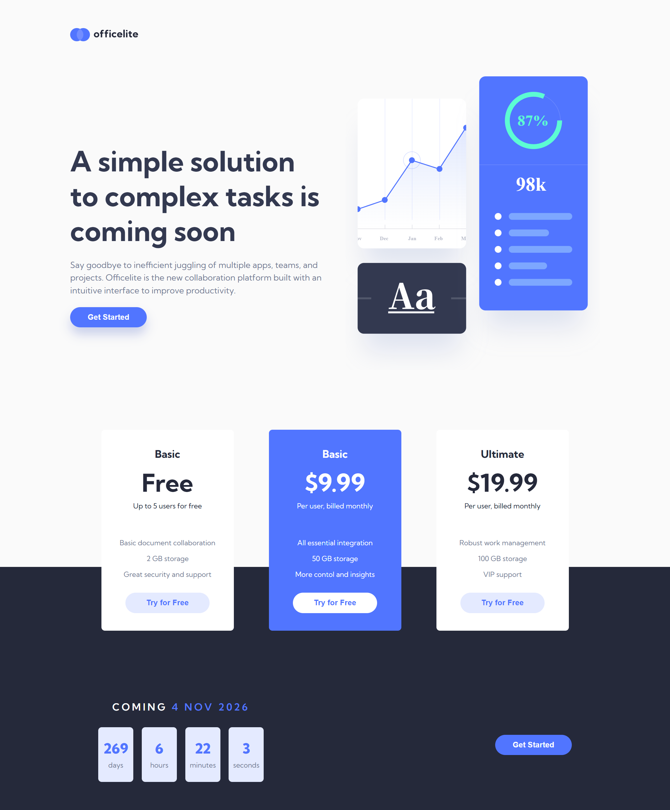
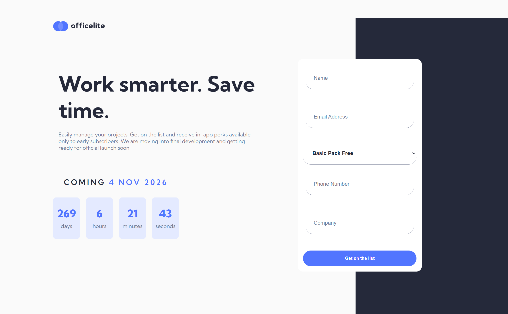

# Frontend Mentor - Officelite coming soon site solution

This is a solution to the [Officelite coming soon site challenge on Frontend Mentor](https://www.frontendmentor.io/challenges/officelite-coming-soon-site-M4DIPNz8g). Frontend Mentor challenges help you improve your coding skills by building realistic projects.

## Table of contents

- [Overview](#overview)
    - [The challenge](#the-challenge)
    - [Screenshot](#screenshot)
    - [Links](#links)
- [My process](#my-process)
    - [Built with](#built-with)
    - [What I learned](#what-i-learned)
    - [Continued development](#continued-development)
    - [Useful resources](#useful-resources)
- [Author](#author)
- [Acknowledgments](#acknowledgments)

## Overview

### The challenge

Users should be able to:

- View the optimal layout for the site depending on their device's screen size &#9989;
- See hover states for all interactive elements on the page &#9989;
- See error states when the contact form is submitted if:
    - The `Name` and/or `Email Address` fields are empty &#9989;
    - The `Email Address` is not formatted correctly &#9989;
- **Bonus**: See a live countdown timer that ticks down every second &#9989;
- **Bonus**: See a custom-styled `select` form control in the sign-up form ❌

### Screenshot

### Links

- Solution URL: [GitHub](https://github.com/jonmc89/officelite-coming-soon-site)
- Live Site URL: [Live Demo](https://jonmc89.github.io/officelite-coming-soon-site/)

## My process

### Built with

- Semantic HTML5 markup
- CSS custom properties
- Flexbox
- CSS Grid
- JavaScript
- Mobile-first workflow

## Author

- Frontend Mentor - [@jonmc89](https://www.frontendmentor.io/profile/jonmc89)
